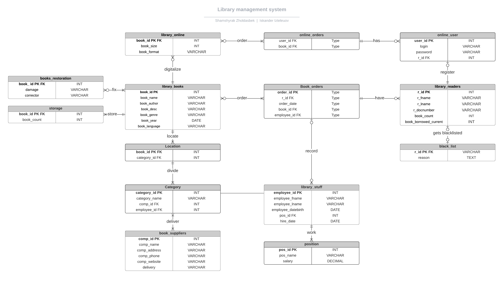

## Database for Library management system
### Description

The purpose of this base is to link all libraries in the city into one network.  Show readers where, in which library is this or that book, is there any information about this book.

## Entity-relationship diagram

